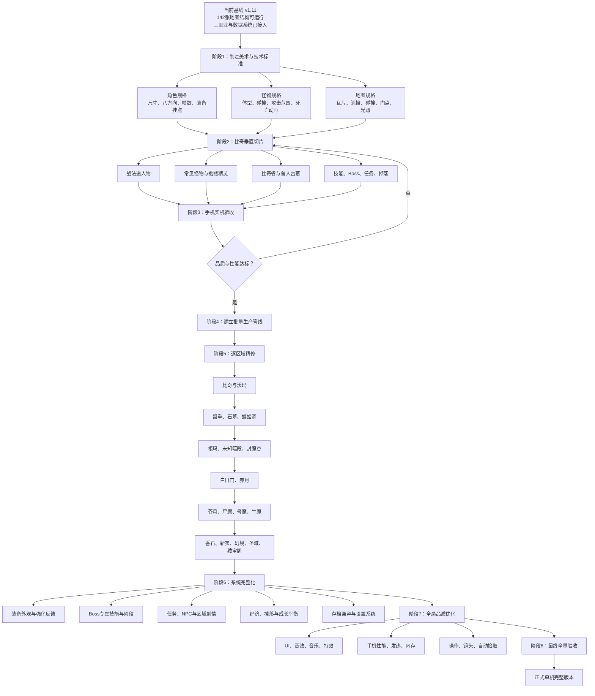

# HardCore 游戏总规划

## NPC 长期运行规则（NPC-FACING-1，2026-07-15）

- NPC 的逻辑朝向统一使用项目八方向顺序：`S、SW、W、NW、N、NE、E、SE`。
- NPC 出生时以实际地图中心点为目标计算默认朝向；不得写死为某个屏幕方向。
- 玩家触发交互时，NPC 必须先转向玩家，再执行商店、仓库、训练、任务或对话服务。
- 经典 NPC 外观以主客户端 `Npc.wil` 为准；原客户端未启用的后三组真实背面视角允许作为项目扩展启用，但不得生成或镜像冒充原始像素。
- 服务端 NPC `Image/appearance` 为外观最高依据；服务端未解析或字段缺失时才允许使用明确标记的运行兜底，不得把兜底值写成原始数据库事实。

## 项目最高定位（核心中的核心）

本项目是品牌名为 **HardCore** 的私人离线刷装游戏项目，不以商业发布为目标。项目核心目标不是单纯复刻某个既有品牌，而是在尽量保留经典 1.76 战斗节奏、刷装循环、地图探索、怪物生态和装备追求的基础上，建立一个可长期扩展的单机游戏框架。

项目允许后续增加新装备、新装备属性、新套装属性、新Boss机制、新地图、新任务、新职业玩法和不同美术风格内容。所有原版内容必须作为“基准层”独立保留；后续创意内容必须作为“扩展层”叠加，不得直接覆盖、改写或污染原版基准数据。

架构设计与任务决策必须始终优先保证：

1. **数据可追溯**：每条数据具有版本层、来源、可信度和变更记录。
2. **玩法可扩展**：装备属性、套装、技能、Boss、任务、职业和地图均通过通用配置或可插拔规则扩展。
3. **资源可替换**：程序逻辑不绑定单一角色、怪物、地图或美术资源，允许逐批替换和风格扩展。
4. **系统可测试**：基准层与扩展层分别验证，新增内容不得破坏原版闭环和既有存档。
5. **内容可批量生产**：地图、怪物、装备、任务和掉落应使用模板、结构化数据和自动校验管线生产。

### 双层内容原则

| 内容层 | 定义 | 默认状态 | 修改规则 |
|---|---|---|---|
| 1.76基准层 | 尽量还原经典版本的地图、怪物、Boss、装备、技能、数值、掉落与节奏 | 默认启用 | 只允许有来源、有审计的校准；不得被创意内容直接覆盖 |
| 创意扩展层 | 新装备、新属性、新套装、新机制、新区域、新任务、新职业玩法与新美术风格 | 独立开关或按资料片启用 | 通过新增ID、独立配置和版本标签叠加，必须能关闭、回退和单独测试 |

从本定位写入之日起，每个新任务开始前必须声明所属内容层；同时影响两层的底层系统必须证明不会污染基准层。若具体任务与本定位冲突，以本定位为最高裁决原则。

## 正式五层架构

项目固定采用以下五层，详细职责、目录、依赖规则、当前文件归属和迁移状态见 [`docs/Five_Layer_Architecture_Standard_and_Migration_Matrix.md`](docs/Five_Layer_Architecture_Standard_and_Migration_Matrix.md)。

1. **原版基准层 Vanilla Core**：只读保存1.76基础世界；必要手感调整使用可追溯`policyOverride`。
2. **扩展内容层 Expansion Layer**：以可关闭扩展包承载私人创意，禁止写入Vanilla。
3. **规则系统层 Rule Systems**：提供通用属性、词条、套装、Buff、触发器和技能公式。
4. **表现资源层 Presentation / Art Skin**：以逻辑ID换皮，绝不改变规则数据。
5. **运行时服务层 Runtime Services**：按`Vanilla + Expansion + User Override`生成Merged Game Database，再驱动所有运行系统。

所有新代码和新数据必须声明所属层；不符合依赖方向的任务不得验收。

本文件是 v1.11 之后开发工作的唯一总规划基准。每批任务开始前确定其所属阶段；完成后按本文件验收、更新累计百分比，并给出下一任务名称与计划。

当前进度续表：`docs/Total_Project_Progress_Continuation.md`；项目结构与文件用途：`docs/Project_Master_Index.md`。

## 任务结构图

## 100%进度权重

| 编号 | 总规划任务 | 权重 | 完成判定 |
|---|---|---:|---|
| T1 | 2D美术与技术标准 | 5% | 角色、怪物、地图、动画、碰撞、资源命名和导入规范全部定稿并经样例验证 |
| T2 | 战法道人物最终资源 | 8% | 三职业方向、移动、攻击、施法、受击、死亡及装备挂点可运行 |
| T3 | 首批怪物与骷髅精灵最终资源 | 8% | 5—8种常见怪物和首个Boss完成造型、动画、碰撞及反馈 |
| T4 | 比奇—兽人古墓精修地图 | 10% | 四图地形、遮挡、碰撞、门点、灯光与环境表现达到垂直切片品质 |
| T5 | 首个完整刷装闭环 | 8% | 接任务、打怪、Boss、掉落、装备、回城完整且通过自动测试 |
| T6 | Android实机品质验收 | 6% | 操作、分辨率、帧率、内存、发热、加载和存档在目标手机验收 |
| T7 | 批量资源与地图生产管线 | 8% | 新角色、怪物、地图、碰撞和数据可按模板低成本接入并自动校验 |
| T8 | 142张地图逐区视觉精修 | 20% | 全地图替换程序占位，具有独立地形、美术、碰撞和正确门点 |
| T9 | 全部Boss专属机制 | 8% | Boss拥有专属技能、阶段、预警、动画、掉落与刷新规则 |
| T10 | 装备、技能、任务、经济与存档完整化 | 10% | 长期成长、装备追求、NPC任务、经济循环和存档兼容完整 |
| T11 | UI、音频、特效与全局性能优化 | 5% | 手机端视听、操作、反馈和性能达到发布品质 |
| T12 | 最终全量回归与发布验收 | 4% | 全职业、全地图、全Boss、全装备、存档和Android包全部通过 |
|  | **合计** | **100%** |  |

## v1.11 新规划起点估算

新规划按“最终品质”而非“数据库是否接入”计分。v1.11 已完成大量底层系统、142张地图结构、Android构建和自动测试，但人物、怪物和地图仍主要是程序占位。

| 任务 | 当前折算 |
|---|---:|
| T1 | 0.5 / 5 |
| T2 | 0 / 8 |
| T3 | 0 / 8 |
| T4 | 1 / 10 |
| T5 | 6 / 8 |
| T6 | 2.5 / 6 |
| T7 | 5 / 8 |
| T8 | 2 / 20 |
| T9 | 2 / 8 |
| T10 | 6 / 10 |
| T11 | 1 / 5 |
| T12 | 2 / 4 |
| **整体累计** | **28 / 100（28%）** |

## 每批任务固定汇报规则

每个任务完成后必须报告：

1. 本批完成内容和可验证产物。
2. 对应总规划编号与该项完成比例。
3. 本批增加的整体百分点。
4. 当前整体累计百分比。
5. 尚未达到的验收条件。
6. 下一任务名称、所属总规划编号、工作范围和预期增加百分点。
7. 由用户对照总规划确认后进入下一批施工。

## 可追溯施工与完整客户端学习强制规则（2026-07-14起）

1. 每次施工必须同步留下三类记录：`docs/Construction_Log.md`记录操作、依据、验证和未完成项；`docs/Project_Master_Index.md`及专项资源目录记录文件位置、来源和用途；本总纲或`docs/Total_Project_Progress_Continuation.md`固化需要长期贯彻的工程原则。
2. 任何原始数据库分类、WIL/WZL文件名、物品类别和人工目录名都只作为来源字段，不作为资源实际用途的最终依据。传奇早期资料存在人工命名不统一、分类错误和跨类别存放，禁止只扫描“看起来相关”的分类后下结论。
3. 至少选择一个完整客户端建立全量知识库：扫描全部资源容器、全部索引帧及真实尺寸、偏移、像素摘要和哈希；需求查询必须建立在这份全量目录上，不得每次临时按文件名猜测。
4. 动画切割必须先由配套客户端源码、索引总数或多个关联库结构证明步长；不得把600帧等经验值无条件套用到所有客户端，否则会跨动作或跨外观混帧。
5. 资源采用必须同时保留原始来源、容器、帧号、切割公式、生成工具和视觉验收图。被截图或像素证据否定的候选必须标记为“已证伪”，不得继续作为正式资源或写成完成。
6. 如果完整客户端的全量知识库确认不存在目标世界层，才允许以已核实的原版装备图标或其他原始证据为造型基准生成扩展资源；生成内容必须进入表现/美术层并明确标为“项目生成”，不得冒充原客户端原帧。
7. 施工记录只有在代码、资源、目录、自动测试和必要的视觉截图均验证后才能标记完成；未完成、待用户视觉确认或未构建的状态必须如实写明。

## 主资料与分级辅助资料强制规则（2026-07-15起）

1. 所有来源查询必须先归入`client_assets`、`client_rules`、`server_data`或`server_rules`之一，不得把像素资源、数据库内容和底层规则混成同一优先级。
2. 四条资料线各自只能有一个主资料：客户端资源以`client.classic_raw_complete`为主，客户端规则以`source.original_gameofmir.mirclient`为主，服务端数据以`server.crystal.cjlaaa`为主，服务端规则以`source.original_gameofmir.server_suite`为主。
3. 固定权重为主资料100、辅1为70、辅2为40、辅3为20；镜像与隔离资料权重为0，不得进入正式运行数据。
4. 每个具体需求必须先查主资料。只有主资料被证明确实缺失、不可用或版本不兼容，才能用`tools/source_priority_guard.py`携带查询过程与原始证据申请辅1；辅2、辅3同理，且必须逐一证明所有更高层均不可用，禁止跳级。
5. 默认禁止跨端拼接。同一成果确需组合多个端时，必须逐项记录需求、端标识、原路径、采用原因和降级授权；不得把多个私服端先合并成无来源的“统一资料”。
6. 镜像只用于哈希与完整性复核；工作副本、探针、锁定/损坏包和隔离端不得作为正式候选。
7. 所有进入运行层的原始或派生内容必须记录资料线、端标识、层级、原路径、查询证据和降级授权报告。正式策略以`assets/data/source_priority_policy.json`为唯一机器可读事实源。

## 游戏品牌与启动链强制规则（2026-07-15起）

1. `dev_art_sources/user_provided/branding/game_icon_master_20260715.png`是当前游戏图标与开场画面的唯一用户确认母版；后续缩放、裁切或格式转换必须记录母版SHA-256，禁止使用生成模型重画后仍冒充同一图标。
2. Godot项目图标、Android启动图标和内置加载画面统一使用`assets/branding/`内的正式派生资源；默认Godot标志不得覆盖游戏品牌。
3. 正式启动顺序固定为“系统应用图标 → 游戏品牌静态加载画面 → 游戏品牌动态开场 → 角色选择”。自定义场景无法在引擎初始化之前执行，因此内置加载阶段必须直接显示游戏品牌，动态场景紧随其后。
4. 开场固定显示文字“刷是一种状态，刷没有目的没有终点”，不得自行增删或改写；动画必须支持横屏自适应，并允许用户在最短展示时间后跳过。
5. 修改品牌或启动链必须重新校验图标尺寸、主场景、下一场景、完整文字、真实OpenGL截图和关键回归；未通过前不得构建正式安装包。

## 手机操作强制要求

- 基础操作采用左侧虚拟摇杆移动、右侧普攻与技能按钮。
- 角色必须支持智能自动选敌，不要求玩家在手机上精确点击每只怪物。
- 自动模式按正面60度、左右侧面、背面三级方向选择，每级内部优先最近目标；移动、普攻和目标技能时重新判定。
- 自动选怪开关关闭后保持当前目标，“换敌”仅在人物正面180度范围内按由近到远循环，不选择背后目标。
- 玩家普通移动只能被怪物阻挡，不能推动怪物；强制位移仅由明确登记的击退类技能产生。
- 直线、扇形技能自动朝锁定目标转向；范围技能以目标位置或摇杆方向落点；增益技能默认自身。
- 锁定目标必须显示脚下标记、名称和生命条，并提供一键切换目标。
- 自动选敌不得强制改变玩家移动方向；是否自动追近必须作为独立设置。
- 自动拾取、攻击辅助和目标筛选属于T11手机操作验收内容。

## 当前进度（M1完成后）

- M1已完成：T1达到100%。
- 本批增加4.5个百分点。
- 整体累计由28%提高到32.5%。
- 19/19项自动测试通过，无残留Godot进程。

## 下一任务

名称：`M2：手机智能选敌、技能参数基线与战士动画运行时`

对应：T2“战法道人物最终资源”的第一批。

计划：

1. 建立手机智能自动选敌、目标保持、死亡切换、手动锁定和取消规则。
2. 冻结三职业技能距离、作用范围、攻击倍率和动画命中帧基线。
3. 确定战士人物最终造型语言、配色和装备轮廓。
4. 制作64×96、八方向的待机、行走、攻击、受击和死亡资源；施法状态预留接口。
5. 建立AnimatedSprite2D动画控制器，将锁敌方向、移动和战斗状态映射到动画。
6. 建立武器、头盔、披风和脚底特效挂点。
7. 在现有角色上启用正式精灵，并保留资源缺失时的程序占位回退。
8. 验证选敌便利性、方向、脚底锚点、攻击时序、像素过滤和Android兼容。

完成效果：战士从程序绘制占位角色升级为第一套可实际游戏的正式人物资源，并形成法师、道士可复用的人物动画运行时。

预计进度：T2从0%提高到约35%，整体进度预计由32.5%提高到35.3%。

## M2交接审计与修正（2026-06-30）

- 审计结论：手机选敌、33技能参数基线、战士待机/行走资源与动画运行时均可运行，5组核心回归测试通过。
- 已修正：行走图集由4帧补齐为技术标准规定的8帧（512×768）；运行时按状态读取正确帧数；动作名不再丢失；攻击/技能按`windup`延迟到命中时刻；增加受击与死亡状态接口及死亡不可被普攻打断规则。
- 稳定性修正：新增PNG后必须先执行Godot无界面导入；禁止在当前目录直接执行全仓库`git status`，避免扫描整个用户目录；图像生成超过合理等待时间且无输出时终止单次任务，不叠加重试。
- 尚未完成：战士攻击6帧、受击3帧、死亡6帧正式透明图集；动作图集接入后还需按关键帧复验命中同步。
- 当前折算：T2约完成26%，整体累计约34.6%。本次主要为纠偏与质量修正，不虚增整体百分点。

## 下一任务（审计后）

名称：`M2-3：战士攻击、受击、死亡图集与动作命中帧收口`

对应：T2“战法道人物最终资源”。

计划：

1. 以现有八方向战士设定为身份基准，分别生成攻击、受击、死亡关键姿势。
2. 绿幕转透明并构建64×96八方向图集：攻击6帧、受击3帧、死亡6帧。
3. 运行时按`attack/hit/death`切换真实图集，并保持资源缺失回退。
4. 将普通攻击与技能`windup/hit_frame`同动画关键帧对齐。
5. 执行素材导入、视觉测试、职业战斗测试和全局冒烟测试。

完成后预期：T2约达到35%，整体累计约35.3%。

## M2-3A完成记录（2026-06-30）

- 完成战士攻击八方向关键姿势、透明化源文件与64×96六帧攻击图集。
- 攻击图集已接入人物运行时；普通攻击0.25秒前摇与第3命中帧对齐。
- 图集构建器新增透明像素脚底锚点自动检测，可复用于后续受击和死亡资源。
- 受击与死亡状态接口已存在；正式图集因内置图像服务连续无响应暂未生成，当前安全回退到待机图集。
- 当前折算：T2约完成29%，整体累计约34.8%；本批增加约0.2个百分点。
- 下一任务：`M2-3B：战士受击3帧、死亡6帧图集生成与接入`，完成后预计整体达到约35.3%。

## M2-3B完成记录（2026-06-30）

- 完成战士八方向受击与死亡关键姿势，保留既定肩甲、护臂、服装、武器与人物身份。
- 使用本地工具完成绿幕转透明、裁切缩放、脚底锚点检测与补帧：受击3帧、死亡6帧。
- 受击与死亡图集已接入人物运行时，死亡状态不可被普通攻击打断。
- Godot资源导入完成；人物视觉、手机选敌、技能参数、职业战斗与全局冒烟共5组测试通过。
- T2当前约完成35%；本批增加约0.5个百分点，整体累计达到约35.3%。
- 尚未达到T2验收的部分：法师和道士最终人物资源、战士装备外观分层与移动端实机视觉验收。

## 下一任务（M2-3B之后）

名称：`M2-4：法师待机、行走、施法基础资源与动画运行时`

对应：T2“战法道人物最终资源”。

计划：

1. 冻结法师人物造型、轮廓、配色与武器挂点。
2. 生成八方向待机、行走和施法关键姿势。
3. 本地完成透明化、补帧、对齐和图集构建。
4. 扩展人物运行时按职业加载资源，保持占位回退。
5. 验证火球、雷电、火墙与魔法盾施法关键帧。

完成后预期：T2约达到55%，整体累计约36.9%。

## 开发顺序调整（用户确认）

- 法师、道士继续采用战士已经验证的八方向角色模板和动画运行时，但最终资源制作暂时后置。
- 当前主线改为“战士职业垂直切片优先”：先完成战士装备、技能、刷怪、Boss、掉落与地图体验，再批量复制到另外两个职业。
- 原`M2-4：法师待机、行走、施法基础资源与动画运行时`保留在T2待办中，不作为当前下一任务。

## M2-4完成记录：战士装备与技能视觉收口（2026-06-30）

- 人物视觉已监听武器、衣服、头盔装备槽及耐久状态，装备变化会即时更新分级反馈层。
- 攻杀剑术、刺杀剑术、半月弯刀、野蛮冲撞、烈火剑法保留独立动作名，并按单体、直线、半月范围、冲撞轨迹和烈火颜色显示区别特效。
- 五个技能继续复用已验收的战士六帧攻击图集，保持各自`windup/hit_frame/cooldown`。
- 修复空字符串装备等级导致的运行时类型错误；五组核心回归测试均无脚本错误并通过。
- T2当前约完成42%；本批增加约0.6个百分点，整体累计约35.9%。
- 法师、道士最终资源和Android实机视觉验收仍未完成，不计入本批。

## 下一任务（战士垂直切片）

名称：`M3-1：比奇战士刷怪样板——首批常见怪物最终资源`

对应：T3“首批怪物与骷髅精灵最终资源”，并支撑T5刷装闭环。

计划：

1. 制作稻草人、钉耙猫、半兽人三种八方向怪物基础资源。
2. 为每种怪物建立待机、移动、攻击、受击、死亡状态与脚底锚点。
3. 接入现有怪物数据、碰撞、仇恨、攻击距离和死亡掉落。
4. 在比奇郊外建立战士自动选敌与连续刷怪验收场景。
5. 验证战士普攻与五技能对三类体型、方向和受击反馈的表现。

完成后预期：T3达到约25%，整体累计约37.9%。

## M3-1完成记录（2026-06-30）

- 完成稻草人、钉耙猫、半兽人三套原创八方向关键原画与透明源文件。
- 本地批量生产管线生成每种怪物的待机4帧、移动8帧、攻击6帧、受击3帧、死亡6帧，共15张正式图集。
- 新增通用`MonsterVisual`运行时，支持方向、移动、攻击、受击和死亡状态；未配置正式资源的怪物继续使用程序占位回退。
- 三种怪物已接入现有数据、仇恨、攻击、差异碰撞、点击锁定、生命条、任务计数、掉落与死亡延迟。
- API仅用于三张关键原画；透明化、裁切、缩放、补帧、受击染色、死亡倒地、锚点和图集均由本地工具完成。
- 怪物视觉、战士视觉、手机选敌、技能参数、职业战斗、全局冒烟、比奇区域和物品目录共8组测试通过且无脚本错误。
- T3达到约25%；本批增加约2.0个百分点，整体累计达到约37.9%。
- 尚未达到T3验收：至少再完成2种常见怪物，以及骷髅精灵Boss的造型、动画、碰撞和反馈。

## 下一任务（M3-1之后）

名称：`M3-2：骷髅精灵Boss与兽人古墓战士Boss战样板`

对应：T3“首批怪物与骷髅精灵最终资源”、T5“首个完整刷装闭环”、T9“全部Boss专属机制”。

计划：

1. 制作骷髅精灵八方向Boss关键原画与五状态图集。
2. 建立Boss专用128×128图集、碰撞范围、名称血条与锁定反馈。
3. 完成近战重击、扇形预警和半血狂暴阶段。
4. 接入兽人古墓刷新、任务、掉落与回城闭环。
5. 使用战士普攻、刺杀、半月、野蛮和烈火完成Boss战自动验收。

完成后预期：T3约达到50%，并推进T5/T9，整体累计约40.4%。

## M3-2完成记录（2026-07-01）

- 完成骷髅精灵原创八方向Boss关键原画与128×128五状态图集。
- 骷髅精灵使用500生命、攻击7—24的现有基准数据，并保留兽人古墓二、三层各一只和60分钟刷新规则。
- 完成Boss大型碰撞、名称血条高度、锁定反馈、固定方向扇形预警、可躲避重击和半血狂暴阶段。
- 半血后提升移动速度、近战范围与攻击频率，并将扇形技能冷却缩短至1.8秒。
- 修复测试碰撞节点未命名和冒烟测试未设置扇形朝向造成的挂起；Boss、普通怪、比奇区域、全局冒烟与战士视觉回归通过。
- T3达到约50%，并推进T5/T9；本批增加约2.5个百分点，整体累计达到约40.4%。
- 尚未达到T3验收：再完成至少2种常见怪物，形成5种常见怪物加首个Boss的完整阵容。

## 项目包清理记录（2026-07-01）

- 将18张高分辨率绿幕/透明源图从运行时`assets`迁移至带`.gdignore`的`dev_art_sources`。
- 删除18个无用源图导入边车、失败草稿缓存和旧`.godot/imported`缓存，并重新导入运行时资源。
- 修复怪物图集工具的输入输出分离：源图从开发目录读取，最终图集只写入`assets/art`。
- 项目目录约60.8MB降至约39.3MB；导入缓存约26.5MB降至约4.9MB；运行时assets约7.8MB。
- 清理属于维护工作，不增加总规划完成百分点。

## 下一任务（M3-2之后）

名称：`M3-3：森林雪人、食人花与比奇常见怪物阵容补齐`

对应：T3“首批怪物与骷髅精灵最终资源”。

计划：

1. 制作森林雪人和食人花八方向关键原画与五状态图集。
2. 为植物型固定怪建立无移动状态和攻击范围差异。
3. 接入比奇刷怪、战士自动选敌、掉落与任务计数。
4. 完成5种常见怪物加骷髅精灵Boss的阵容回归。

完成后预期：T3约达到75%，整体累计约42.4%。

## M3-3完成记录（2026-07-01）

- 完成森林雪人与食人花原创八方向关键原画、透明源文件及五状态正式图集。
- 森林雪人按重型移动怪接入：36生命、攻击7—10、20像素碰撞、52移动速度。
- 食人花按固定植物怪接入：28生命、攻击6—9、移动速度0、攻击距离78，并持续朝向当前目标。
- 正式比奇省刷怪表与演示刷怪表均补入森林雪人和食人花。
- API仅用于两张关键原画；洋红/绿幕处理、补帧、受击、死亡和图集构建全部由本地管线完成。
- 五怪阵容、固定怪行为、比奇区域、全局冒烟、战士视觉、手机锁敌与骷髅精灵Boss共7组相关回归通过。
- T3完成判定已经满足：稻草人、钉耙猫、半兽人、森林雪人、食人花五种常见怪物，加骷髅精灵Boss，均具造型、动画、碰撞和反馈；T3达到100%。
- 本批增加约4.0个百分点，整体累计由40.4%提高到约44.4%。

## 下一任务（M3-3之后）

名称：`M4-1：比奇省地形、美术、碰撞与门点垂直切片`

对应：T4“比奇—兽人古墓精修地图”，并支撑T5刷装闭环。

计划：

1. 替换比奇省程序占位地面，建立草地、土路、水岸、城墙与林地瓦片层。
2. 完成遮挡层、树木建筑碰撞、门点和怪物活动区域。
3. 将五种常见怪物按生态区重新布置，保留手机自动选敌视野。
4. 完成比奇城、兽人古墓入口和回城路线的视觉引导。
5. 验证战士连续刷怪、拾取、回城与再次出发的移动闭环。

完成后预期：T4由约10%提高到约25%，整体累计约45.9%。

## M4-1完成记录（2026-07-01）

- 完成比奇环境母版与运行时图集：8种64×32地表瓦片，以及树木、松树、岩石、城墙4种96×128场景物件。
- 比奇郊外和正式地图ID 4“比奇省”共用垂直切片；其余地图保持原环境回退，不受本批改造影响。
- 地表运行时按坐标组织深浅草地、五向泥土路、废矿石路、树林地表、水岸和外缘水面。
- 建立8棵树、4块岩石、8段北城墙共20处静态碰撞；北城门中央以及兽人古墓、天然洞穴、废矿、沃玛森林、毒蛇山谷五门点均保持畅通。
- 树木采用脚底底层与独立树冠前景层，角色进入树下时形成遮挡关系；切图时物件和碰撞会完整清理并按目标区域重建。
- 图像API仅用于一张关键环境母版；透明化、地砖裁切、菱形遮罩、物件绘制和图集构建均由本地工具完成。
- 新增比奇环境专项测试和实机截图验收；环境、比奇区域、五怪视觉、手机选敌、骷髅精灵Boss、全局冒烟、地图运行时共7组测试通过。
- T4由约10%提高到约25%；本批增加约1.5个百分点，整体累计由44.4%提高到约45.9%。

## 下一任务（M4-1之后）

名称：`M4-2：兽人古墓一至三层地形、遮挡与Boss房精修`

对应：T4“比奇—兽人古墓精修地图”，并继续支撑T5刷装闭环。

计划：

1. 建立兽人古墓石地、裂隙、墙体、石柱、火盆与Boss房环境图集。
2. 为一至三层配置差异化路线、墙体碰撞、门点落脚区和遮挡层。
3. 二、三层构建骷髅精灵Boss房，保留扇形技能的可观察与躲避空间。
4. 加入火盆局部光、洞穴暗角和楼层视觉识别，控制手机画面的战斗可读性。
5. 验证三层连续探索、Boss击杀、掉落、回城卷及重新进入的完整闭环。

完成后预期：T4由约25%提高到约55%，整体累计约48.9%。

## M4-2完成记录（2026-07-01）

- 完成兽人古墓环境母版与运行时资源：8种64×32地表、6种96×128洞穴物件及128×128火光纹理。
- 一层使用雕刻长廊、裂石和骸骨地表形成探索路线；二层建立三火盆四柱符文Boss房；三层建立四火盆血祭Boss房。
- 三层分别配置10、9、9处墙体、石柱与碎石静态碰撞，共28处；入口、下层门点、Boss刷新点及扇形技能六向躲避空间均保持畅通。
- 墙体、石柱、拱门与火盆具有独立前景遮挡层；9盏火盆同时提供加色火光和PointLight2D局部照明，地图外缘使用暗角与深渊地砖收边。
- 二、三层骷髅精灵继续使用既有500生命、扇形预警、可躲避重击、半血狂暴、60分钟刷新与数据库掉落规则。
- 图像API仅用于一张8格洞穴关键母版；色键透明化、裁切缩放、墙柱/火盆/骸骨/碎石/拱门、光纹理及图集构建均由本地工具完成。
- 新增三层环境专项测试并完成三张实机截图；环境、比奇地表、区域、五怪、手机选敌、骷髅精灵Boss、全局冒烟与地图运行时共8组回归通过。
- T4由约25%提高到约55%；本批增加约3.0个百分点，整体累计由45.9%提高到约48.9%。
- 尚未达到T4最终验收：四图还需统一门点落脚反馈、长路线空间引导、手机连续探索性能和最终刷装闭环收口。

## 下一任务（M4-2之后）

名称：`M4-3：比奇—兽人古墓刷装路线与垂直切片收口`

对应：T4“比奇—兽人古墓精修地图”、T5“首个完整刷装闭环”，并支撑T6手机实机验收。

计划：

1. 统一比奇省至古墓三层的门点落脚区、方向提示、返回路线和区域边界反馈。
2. 按战士手机视野复核怪物密度、自动选敌距离、走廊宽度与Boss房逃生通道。
3. 建立“接任务—比奇刷怪—三层Boss—拾取装备—穿戴—回城交付—再次出发”的自动闭环测试。
4. 增加移动碰撞实测、门点防卡、切图资源清理及连续往返稳定性测试。
5. 记录桌面兼容渲染基线，为后续Android真机帧率、内存和发热验收准备指标。

完成后预期：T4达到100%、T5达到100%，整体累计约55.4%。

## M4-3完成记录（2026-07-01）

- 完成比奇省、兽人古墓一至三层的来源感知落脚点；玩家不再跨图后固定回到地图原点。
- 落脚点与门点保持超过105像素交互距离，并通过环境碰撞检测；连续进图不会因一次交互立即返回或卡在墙柱中。
- 门点新增视觉语义：橙色向下表示继续深入、绿色向上表示返回、蓝色保留普通跨区；落脚区新增金色下一目标方向信标。
- 新增真实物理移动验收，角色连续向石柱移动35个物理帧后无法穿透；三层落脚区均可在520像素手机选敌范围内找到目标。
- 完成首个全流程自动测试：接受任务、击杀三只稻草人、穿越三层、击杀骷髅精灵、验证Boss掉落链、使用回城卷、领取100金币与布衣、穿戴布衣、再次出发。
- 修复旧任务奖励“布衣”与数据库“布衣(男)/(女)”名称不一致导致无法穿戴的问题；采用运行时别名兼容旧任务、旧存档和248件物品统计。
- 连续执行13次比奇—古墓往返，方向信标始终单实例、环境节点不增长、碰撞与灯光按地图正确清理。
- 当前桌面兼容渲染基线：AMD Radeon RX 6750 GRE、120 FPS、192节点、73.8MB静态内存、99次绘制调用；该数据仅作为后续Android真机对照。
- 完整闭环、三层环境、比奇环境、区域、五怪、手机选敌、骷髅精灵、物品目录、全局冒烟、地图运行时共10组回归通过。
- T4达到100%，T5达到100%；本批增加约6.5个百分点，整体累计由48.9%提高到约55.4%。
- 尚未达到下一阶段验收：Android目标手机上的触控、帧率、内存、发热、加载、后台恢复与存档仍需实机数据。

## 下一任务（M4-3之后）

名称：`M6-1：Android构建、横屏触控与性能验收基线`

对应：T6“Android实机品质验收”，并支撑T11手机操作与全局性能优化。

计划：

1. 审计Godot Android导出模板、SDK/JDK配置并生成可安装调试APK。
2. 验证横屏分辨率、安全区、虚拟摇杆、攻击、技能、交互、换敌与解锁触控区域。
3. 建立Android分辨率矩阵和自动触控回归，检查16:9、20:9及常见挖孔安全区。
4. 若ADB目标设备可用，记录比奇刷怪和古墓Boss房的帧率、内存、加载时间与10分钟发热趋势；否则先完成可执行的桌面模拟基线并明确真机阻塞项。
5. 验证应用切后台、恢复、回城、自动保存与旧存档兼容。

完成后预期：T6由约42%提高到约70%，整体累计约57.1%。

## M6-1完成记录（2026-07-01）

- 复用项目内OpenJDK 17、Android SDK 36、Godot 4.7导出模板，成功生成arm64调试APK并通过对齐、v2/v3签名校验。
- 修复项目原`orientation=3`实际对应反向竖屏的问题，改为Godot 4.7的Sensor Landscape；最终Manifest方向为横屏用户旋转模式`0xb`。
- APK包名`com.personal.mafaoffline`，版本`22 / 1.12-m6.1`，最低API 24、目标API 36，仅包含`arm64-v8a`。
- HUD新增Android安全区换算：16:9、20:9、左右对称挖孔与单侧挖孔四组矩阵通过；移动端自动隐藏电脑键盘提示。
- 虚拟摇杆、攻击、交互、换敌、解锁及4个技能槽共10个触控目标完成面积和信号接线自动验收。
- 玩家状态在Android暂停、应用失焦和关闭通知时提交存档；继续兼容旧存档中的字符串装备记录。
- 导出过滤排除`tests`、`docs`、`dev_art_sources`和`tools`，最终APK大小34,975,302字节；M6-2全屏修正后的SHA-256为`7D6D8D19B5D48C8D8A3BCD6FCFC0B42EF6392BCEE9DDDD294819D355A37410D0`。
- 修正旧`progression_test`仍按6只比奇怪物验收的问题，更新为当前正式8怪阵容。
- Android布局、完整刷装闭环、三层环境、比奇环境、手机选敌、骷髅精灵、物品、成长、冒烟、地图运行时共10组回归通过。
- ADB已检查但当前无连接设备；因此真机帧率、PSS内存、发热、加载和触控手感明确不计为完成。
- T6由约42%提高到约70%；本批增加约1.7个百分点，整体累计由55.4%提高到约57.1%。

## 下一任务（M6-1之后）

名称：`M6-2：Android真机安装与10分钟刷怪/Boss压力验收`

对应：T6“Android实机品质验收”和T11“手机操作与全局性能优化”。

计划：

1. 通过ADB安装M6-1调试APK，核对首次启动、横屏、沉浸模式和安全区。
2. 在比奇省连续移动、自动选敌、刷怪、拾取和打开面板10分钟。
3. 在兽人古墓二层Boss房连续战斗10分钟，记录最低帧率、PSS内存、加载时间和电池温度变化。
4. 验证多点触控、边缘摇杆、连续攻击、技能、换敌、解锁、交互及误触率。
5. 切后台30秒后恢复，核对角色状态、存档、音画和输入是否正常。

开始条件：连接一台arm64 Android真机并启用USB调试。完成后预期T6达到100%，整体累计约58.9%。

## M6-2完成记录（2026-07-01）

- 荣耀90（REA-AN00、Android 15/API 35、1200×2664、520dpi）通过荣耀官方HonorSuite驱动建立ADB连接。
- APK安装成功，arm64包体、v2/v3签名、API 24—36、版本22/1.12-m6.1均在真机确认。
- 首次冷启动722ms；发现20:9横屏左右黑边后，将Godot拉伸策略改为`canvas_items + expand`，重新导出安装后完整铺满2664×1200。
- 摇杆真实移动、普通攻击、换敌、解锁、技能和交互触控均通过；攻击后自动锁定多钩猫并显示目标生命。
- 切后台30秒时自动更新存档，恢复后保持同一PID并回到游戏前台，无输入或画面异常。
- 在兽人古墓二层完成611秒真机压力测试，共21个样本，进程全程存活且无重启。
- SurfaceFlinger帧率最低60.5、平均60.62、最高60.7 FPS；温度38—40°C，电量93%降至92%。
- 首样本PSS 469.0MB，热身后稳定在411.3—415.2MB；该数值在荣耀90稳定，但列入T11低内存设备优化目标。
- 实际战斗结束时角色达到8级、1510/1700经验、1466金币，并产生金币1000和金创药掉落，验证压力阶段包含真实战斗与掉落。
- 真机日志中Android崩溃0、Godot脚本错误0；T6达到100%。
- 本批增加约1.8个百分点，整体累计由57.1%提高到约58.9%。

## 下一任务（M6-2之后）

名称：`M7-1：地图环境、碰撞与区域配置批量生产模板`

对应：T7“批量资源与地图生产管线”，并为T8“142张地图逐区视觉精修”提供生产基础。

计划：

1. 将比奇省和兽人古墓的地砖选择、物件布置、碰撞、灯光、门点安全区抽取为数据驱动模板。
2. 建立地表、洞穴、寺庙、矿区、沙地五类环境主题配置和统一运行时接口。
3. 编写图集规格、纹理尺寸、碰撞数量、门点畅通与资源引用自动校验器。
4. 用天然洞穴一至二层作为首个“无定制代码”批量接入样板。
5. 验证模板在桌面与荣耀90上不会增加节点残留，并记录内存变化。

完成后预期：T7由约63%提高到约80%，整体累计约60.3%。

## 碰撞、接地与占位怪攻击热修复记录（2026-07-01）

- 根场景启用Y轴排序；人物与怪物正式图集脚底下沉到接触面，并为人物、怪物和召唤物增加双层椭圆接触阴影。
- 人物、怪物和召唤物明确配置物理层、碰撞掩码、安全边距与浮动运动模式；怪物近身距离包含双方碰撞半径及安全余量。
- 怪物群新增同类分离，贴得过近时主动后退，解决多个怪物叠进人物或彼此重叠的问题。
- 所有尚无正式攻击图集的占位怪加入通用攻击前摇、12像素扑击和方向挥击反馈；比奇五种正式怪物及骷髅精灵仍使用各自五状态图集。
- 修复角色过图后继承移动速度、导致落脚点额外滑动约2–3像素的问题；传送和切图现在会清零速度。
- 新增拥挤接地和占位攻击动画专项测试；拥挤、占位攻击、比奇五怪、手机选敌、骷髅精灵、完整刷装闭环、全局冒烟及地图运行时共8组回归通过，且无脚本错误。
- 新调试包为`MafaOffline_M6_2_hotfix.apk`，版本23 / `1.12.1-hotfix`，大小34,979,398字节，SHA-256为`CA69013E09940FCB1D24B5347C915C442D9CBE8C6B9249731148D16D11BB5057`。
- 本次属于已完成功能的质量修正，不增加总规划百分比；整体仍为58.9%，下一任务仍为M7-1。

## 手机选敌、不可推怪与Boss朝向规则修正（2026-07-01）

- 人物普通移动不再迫使怪物后退；怪物只在创建瞬间修正非法出生重叠，正常游戏中玩家会被实体碰撞挡住。强制位移继续仅由野蛮冲撞等击退类技能触发。
- 自动选怪改为三级方向优先：正面60度区域、左右侧面、背面；每级内部选择最近目标，只有正面和侧面均无怪时才选背面。
- 自动模式在人物实际移动、普通攻击和需要目标的技能触发时重新读取怪物位置，不再保留旧目标黏性。
- HUD“解锁”改为“自动：开/关”开关。关闭自动后目标保持不变；“换敌”才生效，并只在人物正面180度范围内按距离由近到远循环，不会切换背面目标。
- Boss追击每个物理帧重新朝向当前玩家位置；选中圈改为与脚底阴影共面的低透明细线椭圆，消除发光圆盘造成的悬空感。
- 手机选敌专项、拥挤接地、Android布局、比奇五怪、骷髅精灵Boss、完整刷装闭环、全局冒烟、地图运行时及占位攻击动画共9组测试通过，Boss光圈桌面截图验收通过。
- 按新的构建节奏，本批不导出APK；仅在重要里程碑、累计一批修复或明确安排真机验收时统一打包。
- 本批为操作规则与品质修正，不增加总规划百分比；整体仍为58.9%，下一任务仍为M7-1。

## M7-1完成记录：地图环境、碰撞与区域配置批量生产模板（2026-07-01）

- 将比奇省、兽人古墓一至三层的地表路线、物件、碰撞、灯光和预期数量从`WorldBackground`迁移到独立`EnvironmentCatalog`；运行时不再保存地图布局常量。
- 建立地表、洞穴、寺庙、矿区、沙地五类主题，统一登记地砖/物件图集路径、单元尺寸、图集数量、灯光资源和运行时资源集。
- 新增统一环境接口：主题与地图配置读取、地砖选择、物件/前景生成、圆形/矩形碰撞、局部灯光、节点统计和阻挡查询。
- 新增`EnvironmentValidator`，自动检查资源存在性、纹理尺寸、物件索引、碰撞类型与数量、灯光数量、门点无阻挡及地表路线接通。
- 地图248“洞穴一层”和249“洞穴二层”成为首个无定制渲染代码样板；`WorldBackground`中不存在248/249分支，仅通过目录数据生成差异物件、4/6处碰撞、2/3盏灯光和主通道。
- 天然洞穴完成桌面画面验收；8轮双图往返节点数量保持稳定，静态内存变化-89KB，无环境节点、碰撞或灯光残留。
- 环境模板、比奇环境、三层古墓、手机选敌、拥挤接地、Android布局、完整刷装闭环、骷髅精灵、全局冒烟和地图运行时共10组最终回归通过，无脚本错误或残留Godot进程。
- 按用户确认的构建节奏，本批不单独导出APK；荣耀90模板复验合并到下一次重要里程碑构建，不重复生成小版本安装包。
- T7由约63%提高到约80%；按T7权重8%折算，本批增加约1.4个百分点，整体累计由58.9%提高到约60.3%。
- T7尚未最终验收：需要把模板扩展到多主题批量地图，并在里程碑APK中复核荣耀90往返内存与节点稳定性。

## 下一任务（M7-1之后）

名称：`M7-2：五类环境主题首批区域批量接入与管线收口`

对应：T7“批量资源与地图生产管线”，并开始支撑T8“142张地图逐区视觉精修”。

计划：

1. 将比奇矿区、沃玛寺庙、盟重沙地分别接入矿区、寺庙和沙地主题，形成五类主题均有运行地图的样板矩阵。
2. 根据区域门点和地图ID批量生成路线、环境种子、物件密度、灯光与安全区配置，减少手写重复数据。
3. 增加批量地图配置覆盖率报告、重复资源检查、节点预算和连续跨区残留测试。
4. 选取至少10张地图完成模板迁移，验证怪物、Boss、掉落和任务运行时不受环境切换影响。
5. 在M7里程碑统一导出一次APK，并在荣耀90复核跨主题往返、PSS内存和触控可读性。

完成后预期：T7由约80%提高到100%，本批预计增加约1.6个百分点，整体累计约61.9%。

## M7-2完成记录：五类环境主题首批区域批量接入与管线收口（2026-07-01）

- 新增门点驱动的确定性环境生成器：从地图ID与固定门点生成主路线、环境种子、主题物件、实体碰撞、灯光和安全区；相同地图重复进入会得到完全一致的配置。
- 批量接入17张地图：沃玛寺庙312–315、比奇矿区401–412、盟重省478；连同M7-1的6图，环境模板共覆盖23图。
- 五主题均具运行样板：地表1图、洞穴5图、寺庙4图、矿区12图、沙地1图；矿区使用冷灰调色、寺庙使用暖色火光、盟重使用沙地底色和六向道路。
- 物件生成自动避开门点、中央落脚区和主路线；碰撞、灯光、前景节点及静态体均纳入逐图节点预算。
- 覆盖率报告增加主题地图计数、共享图集规格冲突检查和资源复用关系；自动校验范围扩展至全部23张模板地图。
- 10张代表地图连续跨主题往返40次，节点数量与逐图预算一致，无环境残留；静态内存变化约+691KB。
- 沃玛寺庙双Boss、矿区完整区域链、盟重NPC和六门点保持正常；批量环境没有改变怪物、Boss、掉落、任务或商店运行时。
- 环境批量、M7-1模板、比奇、古墓、矿区、沃玛、盟重、完整刷装闭环、性能、手机选敌、全局冒烟与地图运行时共12组回归通过。
- 仅在T7收口时统一导出一次M7里程碑APK：版本24 / `1.13-m7.2`，大小34,996,132字节，SHA-256为`2C83B207B7FEC41CC470D8C7AC3E6755E9C96B9FD750A2FBDFB3D5140AB8F850`。
- 构建后荣耀90重新连接，直接复用现有APK覆盖安装成功；确认版本24 / `1.13-m7.2`、横屏全屏、地图目录、自动选怪开关和洞穴二层模板切换正常。
- 真机启动后PSS约446.7MB、RSS约525.4MB，检查窗口内Android崩溃0、Godot脚本错误0；按用户要求采用简要验收，不继续长时间压力测试。
- T7达到100%；按T7剩余20%和权重8%折算，本批增加约1.6个百分点，整体累计由60.3%提高到约61.9%。
- 说明：23图完成的是批量环境结构接入，不等于T8逐图最终美术精修；复用主题资源的地图仍需逐区替换为独立地形和美术。

## 下一任务（M7-2之后）

名称：`M8-1：比奇矿区401–412逐图地形与场景美术精修`

对应：T8“142张地图逐区视觉精修”。

计划：

1. 制作矿区专用地砖、矿轨、木支架、矿车、岩壁、桥梁和矿灯资源，不再复用兽人古墓主题图集。
2. 根据12张矿区地图的路线关系建立入口、桥区、回收站、深层矿道和南部区域的差异化布局。
3. 为每图配置独立遮挡、实体碰撞、门点落脚安全区、僵尸活动区和手机视野引导。
4. 保持尸王殿入口、双尸王、僵尸掉落及矿区完整往返链，增加逐图截图和自动验收。
5. 完成整区后再统一安排一次里程碑构建，不为单张地图重复导出APK。

完成后预期：T8由约10%提高到约20%，增加约2.0个百分点，整体累计约63.9%。

## MIR2-WARRIOR-7-2完成记录：参考服务端数据索引与战士MIR2原始动作替换（2026-07-02）

- 新增`docs/Server_Data_Reference_Index.md`，明确当前可用服务端来源：`MirServer/Mir200/!Setup.txt`、`M2Server/*.pas`、`MirClient/Actor.pas`、客户端WIL/MAP资源和项目结构化JSON。
- 自检确认当前本地没有完整传统服务端数据包：未找到`Envir/MapInfo.txt`、`Envir/MonGen.txt`、`Envir/MonItems/*.txt`、`Monster.DB`、`StdItems.DB`、`Magic.DB`；后续涉及地图、刷怪、掉落和怪物数值时必须标记该缺口，不得把项目内推导数据冒充完整服务端DB。
- 摘录服务端关键参数：出生点`0/289/618`、红名回城点`3/845/674`、`MonGenRate=20`、`HitIntervalTime=600ms`、`MagicHitIntervalTime=600ms`、`MagicAttackRage=8`和三职业HP成长相关值。
- 保留用户已确认的手机战士普攻手感：`850ms`续刀间隔、`510ms`完整动作锁；服务端`HitIntervalTime=600ms`作为参考值，不直接覆盖。
- 根据`MirClient/Actor.pas`的`HA`动作表，从`Hum.wil` dress2提取战士原始动作：待机4帧、走路6帧、攻击6帧、受击3帧、死亡4帧，八方向均完成。
- 替换战士五套动作图集为MIR2原始大帧：`warrior_idle.png`、`warrior_walk.png`、`warrior_attack.png`、`warrior_hit.png`、`warrior_death.png`；旧占位图已备份到`backup_before_mir2_assets`。
- 运行时新增战士专用`192×160`帧尺寸和`64/80`脚底锚点，走路/死亡帧数按原始客户端表读取；保留`64×96`占位规格给尚未替换的职业和资源。
- 生成`warrior_mir2_full_motion_manifest.json`记录每帧来源索引、偏移、尺寸和粘贴坐标，后续装备外观或帧错位可追溯。
- Godot 4.7 `--check-only`通过，数据库载入仍为地图142、怪物217、Boss46、装备175、技能等级132、掉落槽3424、任务9；本批不导出APK。
- 进度折算：本批属于T2“战法道人物最终资源”的战士资源质量修正，T2约由32%提升到约37%，按T2权重8%折算增加约0.4个百分点；整体累计约由61.9%提升到约62.3%。

## 下一任务建议（MIR2-WARRIOR-7-2之后）

名称：`MIR2-DATA-1：服务端数据缺口补齐与项目结构化数据校准`

对应：T5、T7、T10，并为T8/T9提供数据基准。

计划：
1. 为缺失的`Envir/MapInfo.txt`、`MonGen.txt`、`Monster.DB`、`StdItems.DB`、`Magic.DB`建立导入目录和校验器。
2. 若用户补充完整服务端数据包，则直接解析；若暂时没有，则从当前`legend176_data.json`导出对照表并逐项标记“项目推导/网络资料/服务端配置/客户端资源”来源。
3. 用服务端`!Setup.txt`校准出生点、回城点、经验表、动作间隔、魔法距离、职业成长和刷怪比例。
4. 生成地图、怪物、Boss、装备、技能、掉落、任务七张数据源差异报告。
5. 只在数据校准稳定后，再进入下一批怪物/Boss/地图资源替换，避免美术接入后发现ID和刷怪表错位。

完成后预期：不大幅增加总进度，主要提升数据可信度；若补齐完整服务端DB，T10和T5可各增加约0.5~1.0个百分点。

## MIR2-DATA-1完成记录：服务端数据缺口补齐与项目结构化数据校准（2026-07-02）

- 新增`tools/audit_service_data.py`，可重复读取服务端`MirServer/Mir200/!Setup.txt`，扫描完整服务端`Envir/DB`数据包是否存在，并审计项目七张结构化表。
- 生成机器可读参考文件`assets/data/service_reference.json`，固化服务端关键参数、1-60级经验表、完整DB缺口清单、七张项目表行数与来源覆盖率。
- 生成`docs/MIR2-DATA-1_Server_Data_Calibration_Report.md`，明确当前本地缺少8类传统服务端数据：地图信息、刷怪表、怪物掉落、商人、NPC脚本、怪物DB、物品DB、技能DB。
- 确认项目当前七张主表规模：地图142、怪物217、Boss46、装备175、技能等级132、掉落槽3424、任务9；sourceUrl与verification字段均已有覆盖，但掉落表可信度仍主要为C，需后续用完整服务端DB校准。
- 服务端`!Setup.txt`关键参数已固化：出生点`0/289/618`、红名回城点`3/845/674`、`MonGenRate=20`、`HitIntervalTime=600ms`、`MagicHitIntervalTime=600ms`、`MagicAttackRage=8`、三职业HP成长参数和1-60级经验表。
- 保留用户指定的手机版战士普攻手感：服务端参考`600ms`，当前移动端设计`850ms`，该覆盖决策写入`policyOverrides.normalAttackIntervalMs`。
- 新增`tests/service_data_reference_test.gd/.tscn`，自动校验服务端参数、8项DB缺口、七张表行数和普攻间隔覆盖决策，防止后续误删或误判。
- 验证：Godot 4.7 `--check-only`通过；`service_data_reference_test.tscn`通过；本批不导出APK。
- 进度折算：本批主要提升T10“装备、技能、任务、经济与存档完整化”和T5/T7的数据可信度，整体增加约0.3个百分点；累计约由62.3%提升到约62.6%。

## 下一任务建议（MIR2-DATA-1之后）

名称：`MIR2-DATA-2：服务端!Setup参数接入运行时——出生点、经验表与职业成长校准`

对应：T10，并支撑T5首个完整刷装闭环。

计划：
1. 新增运行时读取`service_reference.json`的入口，避免把服务端参数散落在脚本常量里。
2. 将出生点、红名回城点、1-60级经验表接入`PlayerState`/地图传送逻辑。
3. 用服务端职业HP成长参数校准战士、法师、道士基础成长，同时保留现有装备加成和测试模式。
4. 对比当前项目经验/等级/死亡回城行为，生成差异说明。
5. 增加回归测试，验证出生点、升级阈值、职业HP顺序、死亡/回城落点不被后续改坏。

完成后预期：T10小幅提升，整体约增加0.4~0.6个百分点；若用户随后补齐完整`Envir/DB`数据包，再进入完整DB解析任务。
## MIR2-DATA-2完成记录：服务端!Setup参数接入运行时——出生点、经验表与职业成长校准（2026-07-02）
- 新增运行时服务端参考入口：`GameData`现在会读取`assets/data/service_reference.json`，集中提供出生地图、出生坐标、经验表、职业成长参数和策略覆盖值，不再把这些关键参数分散写死在业务脚本里。
- `PlayerState.experience_to_next_level()`已接入服务端运行时经验表；1—60级优先使用从`M2Share.pas`提取的`g_dwOldNeedExps`，旧项目内置1—22级表作为兜底保留。
- 三职业基础HP/MP成长已接入服务端源码公式：战士、法师、道士按`ObjBase.pas`成长逻辑计算；同时保留现有装备加成、职业选择和低级技能测试流程。
- 地图传送逻辑新增`travel_to_service_home()`：运行时优先按服务端`HomeMap/HomeX/HomeY`和`RedHomeMap/RedHomeX/RedHomeY`取值；由于当前缺完整`MapInfo.txt`，HomeMap=0与RedHomeMap=3还无法映射到项目地图表，因此暂时回退到已完成的比奇垂直切片。
- 修正回城卷 fallback：启动时仍可进入比奇刷怪样板区，`回城卷`在缺MapInfo时明确回退到“比奇城”，避免破坏M4/M5已经完成的刷装闭环。
- 新增`tests/service_runtime_integration_test.gd/.tscn`，校验服务端出生点、红名回城点、1/23/40级经验阈值、三职业20级HP/MP成长顺序，以及MapInfo缺口是否被显式记录。
- 回归验证通过：`service_runtime_integration_test.tscn`、`service_data_reference_test.tscn`、`progression_test.tscn`、`bich_area_test.tscn`均通过；`--check-only`在当前Godot 4.7控制台组合下会留下主进程不退出，本轮已改用可自动退出的场景级回归，未继续长时间占用资源。
- 本批按用户要求不导出APK；运行时数据校准属于底层规则修正，合并到下一次重要里程碑包统一验证。
- 进度折算：T10“装备、技能、任务、经济与存档完整化”的数据可信度继续提升，本批增加约0.5个百分点；整体累计由约62.6%提升到约63.1%。

## 下一任务建议（MIR2-DATA-2之后）
名称：`MIR2-DATA-3：完整Envir/DB数据包导入器与差异合并规则`

对应：T5、T8、T9、T10，是后续“所有地图、所有怪物、所有Boss、所有装备、所有掉落”继续做实的关键数据底座。
计划：
1. 建立`import_server_data`目录规范，支持用户放入`Envir/MapInfo.txt`、`MonGen.txt`、`MonItems/*.txt`、`Monster.DB`、`StdItems.DB`、`Magic.DB`等传统服务端数据。
2. 编写解析器与差异合并规则，将服务端地图门点、刷怪、掉落、怪物、装备、技能映射到项目七张结构化表。
3. 对每条导入数据标记来源、可信度、版本标签：`2003官服1.76基准版`或`1.76后期追加内容`。
4. 生成差异报告，明确哪些内容来自真实服务端DB，哪些仍是项目推导或网络资料。
5. 在不破坏现有比奇—古墓闭环的前提下，先导入一小批可验证数据，再扩大到全表。

完成后预期：如果完整数据包可用，T10和T5可信度会明显提升，整体预计增加约0.8—1.2个百分点；如果仍缺DB，则先完成导入框架和缺口报告，整体小幅增加约0.3个百分点。

## ARCH-FINAL完成记录：五层架构正式封板（2026-07-04）

- 五层固定为Vanilla Core、Expansion Layer、Rule Systems、Presentation / Art Skin、Runtime Services。
- T0-1至T0-8全部验收完成；Vanilla保持只读，新内容只能通过独立扩展包进入。
- Modifier/Effect/Trigger/Condition、套装组合、Boss技能库、三种游戏模式及存档内容版本已经接入运行时。
- 架构静态审计和最终运行测试通过；架构完成不代表全部地图、装备、怪物和任务内容完成。
- 当前完成度：比奇93.7%，总体84.5%。

## 当前任务指针

下一任务：`BICH-WARRIOR-1：比奇战士基础战斗闭环与技能数据化`。

计划：先复核移动和攻击朝向、850ms续刀与完整收招，再依次验收基本剑术、攻杀、刺杀、半月、野蛮、烈火，最后与通用装备属性系统联测。本阶段不为普通步骤重复导出APK。

## BICH-WARRIOR-1完成记录（2026-07-04）

- 基础攻击事务、六项战士技能数据和通用装备属性联动完成。
- 比奇进度94.5%，总体进度85.1%。
- 下一任务：`BICH-WARRIOR-2：六技能实战命中表现与怪物交互验收`，逐项检查命中目标、伤害范围、推离规则、特效时点及怪物反馈。

## BICH-CITY-1完成记录：哥特比奇主城标准样板（2026-07-04）

- 开发顺序调整为：彻底打磨比奇区域 → 三职业跑通 → 建立完整可玩样板 → 复制到其他地区。
- 用户绿幕素材本地处理为72张标准RGBA资源，建立中央篝火、安全区、功能NPC分区、主路、南门、仓储、商店、任务和训练关系。
- 新增可交互仓库及角色独立仓库存档；怪物不会在主城安全区出生或追击进入。
- 桌面专项与比奇区域回归通过；当前比奇约95.4%，总体约86.0%。
- 下一任务：`BICH-CITY-2：哥特比奇主城真机视觉与动线打磨`。

## WARRIOR-SKILL-VISUAL-AUDIT-2完成记录：战士技能动画统一契约（2026-07-15）

- 战士六技能八方向已按主客户端像素与主客户端规则重新验收。
- 人物身体、武器、头盔、Magic特效统一共享经典角色原点；各图层可使用独立画布，禁止为复用身体region裁切长武器。
- 超过2048单纹理上限的原始特效必须分片，禁止缩放源像素改变人物/武器/特效比例。
- 从武器端点发出的技能必须使用“当前装备×方向×动作帧”的像素附着元数据，禁止写死单武器或单截图偏移。
- 裁决旧布局9个攻击裁切帧已归零；烈火恢复1:1像素并逐帧吸附武器头；完整关键回归51/51。
- 下一任务仍为`NPC-DATA-2`，本次插单完成后返回NPC主服务端精确数据提取。
## 完整物品系统长期规则（COMPLETE-ITEM-SYSTEM-1，2026-07-15）

- 物品数据只能按`server_data`优先级进入项目：主服务端完整记录优先，辅助端不能直接混用。
- 物品像素固定按主客户端同索引、证据授权的辅1同索引、项目分类补图顺序选择；每次降级必须保留失败原因和原路径。
- `Items`用于背包图，`DnItems`用于地面掉落图，禁止用统一菱形、圆点或背包截图替代地面资源。
- 透明但非空的1×1帧、肉眼不可辨认的占位像素和Godot无法实际加载的未导入PNG均判定为不可用。
- 普通药瓶按服务端分跳恢复池运行，太阳水即时恢复；传送卷必须调用统一空间契约，不能绕过地图边界、障碍和实体占位。
- 私服/后期装备即使存在于主服务端数据库，也必须先留在装备参考层；没有通过装备专项的记录不得自动进入可穿戴层。

## 插入式界面主线（2026-07-16）

- `UI-GOTHIC-PREVIEW-1`：人物选择+创建、游戏内退出、统一 HUD 三张暗黑哥特审图样板——已完成，等待用户确认。
- `UI-GOTHIC-INTEGRATION-1`：用户确认后建立可复用主题并正式接入全部界面——待确认。
- `UI-GOTHIC-ANDROID-1`：正式接入、交互回归和 Android 布局验证后打包 APK——待确认与集成完成。
- 强制门禁：审图未确认前不得替换 `character_select`、`game_root`、`hud` 或打包 APK。
- HUD固定规则：不显示物品栏和当前追踪；血球/蓝球分列技能区两侧；技能每行最多4个；战士用自动施放开关，法师/道士用包含普通攻击的技能单选；保留切敌与自动锁定。
- 战士技能规则：基本剑术、攻杀剑术为常驻被动且不可点击；刺杀、半月、野蛮、烈火才显示自动开关。
- HUD位置规则：移除左上人物身份卡；自动锁定固定在右侧扩展栏；切换敌人固定在攻击/释放技能键旁。
- 战士技能栏：隐藏基本剑术、攻杀剑术；刺杀/半月/烈火使用自动开关；野蛮冲撞独立放在攻击键旁，点击一次立即使用且不改变普通攻击。
- 战斗物品栏：底部固定4格，轻触使用、长按弹出选物菜单；候选包括药水、回城卷、随机传送卷；技能开关位于物品栏上方。
- 技能页面与快捷键：攻击键周围固定3个技能按钮；技能页展示等级/熟练度/类型/消耗/冷却/范围/说明，长按技能后选择放入1/2/3。技能开关层仅战士可见。
