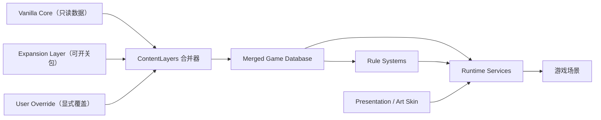

# 玛法离线五层架构规范与迁移表

> 生效日期：2026-07-04  
> 架构任务：`ARCH-FINAL`（已封板）  
> 最高原则：科学隔离优先于短期改动便利

## 一、固定五层

### 1. 原版基准层 Vanilla Core

职责：尽量还原1.76基础世界，包括地图、怪物、Boss、装备、技能、经验、职业成长、掉落、刷新、NPC、地图连接和战斗节奏。

规则：

- 默认启用且不可变；运行时不得原地写入。
- 每条正式拆分记录包含 `contentLayer=vanilla_core`、`source`、`confidence`、`editable=false`。
- 手机适配等必要改变必须写入 `policy_overrides.json`，同时保留原值、调整值、原因、范围和来源。
- 社区校准不得冒充原始资料；冲突值并存，不静默覆盖。

当前目录：`assets/data/vanilla_176/`。地图、怪物、Boss、装备、技能、掉落、任务、经验、刷新、NPC、地图连接、区域掉落和职业成长均已拆表；旧常量仅作为离线导出母本保留，不再作为运行时读取入口。

### 2. 扩展内容层 Expansion Layer

职责：承载私人新装备、词条、套装、Boss、地图、掉落、任务、职业玩法和资料片内容。

规则：

- 每个扩展拥有独立目录、清单、ID、启用开关和合并策略。
- 默认关闭；关闭后Vanilla必须独立运行。
- `add_only`只允许新增；`explicit_override`必须显式指定覆盖目标并保留来源。
- 禁止修改`vanilla_176`内的任何文件。

首个模板：`assets/data/expansions/personal_expansion_001/`，包含装备、词条、套装、Boss、地图、掉落和任务七张空表。

### 3. 规则系统层 Rule Systems

职责：处理属性、公式、Buff、触发器、技能、装备实例和套装组合，不拥有具体美术资源。

通用运算：`add`、`percent`、`multiply`、`override`。当前Schema覆盖基础属性、战斗属性、技能属性及`on_attack/on_hit/on_kill/on_damaged/on_skill`触发器。

当前正式规则模块：装备、职业、战士战斗公式、选怪、坐标映射、`Modifier / Effect / Trigger / Condition`执行器、独立套装效果和Boss技能组合库。旧玩法行为可通过兼容适配器调用，但新增内容不得再写死属性或Boss专用机制。

### 4. 表现资源层 Presentation / Art Skin

职责：把角色、怪物、装备、地图等逻辑ID映射到图集、动画、锚点、阴影、音效和特效。

规则：

- 换皮不得改变数值、AI、碰撞、技能和掉落。
- 皮肤包必须有独立`skin_manifest.json`。
- 同一逻辑ID可绑定多个风格包。

当前皮肤：`classic_client`。角色和怪物表现均通过`PresentationAssets`按逻辑ID解析；新增风格只能增加皮肤清单，不得修改怪物逻辑数据。

### 5. 运行时服务层 Runtime Services

职责：内容合并、存档、战斗、Buff、掉落、地图、刷怪、任务、装备、技能、目标锁定、Android输入和自动测试。

固定合并顺序：

```text
Vanilla Core
    + Expansion Packages（仅启用包）
    + User Override（显式私人调整）
    ↓
Merged Game Database
    ↓
GameData / Runtime Systems
```

散表只能由`ContentLayers`读取；玩法系统只读取合并后的数据库。`RuntimeServices`提供存档、安全退出、扩展开关和内容状态门面。

## 二、依赖方向



禁止反向依赖：Vanilla不得引用扩展；规则不得写数据源；表现不得改变规则；扩展不得直接调用场景节点。

## 三、当前文件归属

| 层 | 正式入口 | 兼容适配器/待迁移 |
|---|---|---|
| Vanilla | `assets/data/vanilla_176/*.json`、`assets/data/layers/vanilla_core.json` | `legend176_data.json`及旧常量仅作为离线生成母本 |
| Expansion | `assets/data/expansions/*/manifest.json` | 旧`laterVersion`过滤由PlayerState开关适配 |
| Rules | 装备、职业、战斗公式、选怪、坐标、Modifier执行器、Boss机制库 | 现有技能行为通过稳定适配器逐批迁移，不允许新增硬编码 |
| Presentation | `assets/presentation/skins/*/skin_manifest.json`、`PresentationAssets` | 无运行时美术路径泄漏 |
| Runtime | `ContentLayers`、`WorldContent`、`GameData`、`PlayerState`、Combat/Loot/Targeting/Domain/GameModes服务 | `game_root.gd`只保留场景编排职责 |

## 四、自动保障

- `tools/build_five_layer_database.py`：从受控母本重建只读Vanilla表和运行时合并快照。
- `tools/audit_five_layer_architecture.py`：检查五层清单、文件存在性、基准不可变、扩展默认关闭、合并顺序和规则Schema。
- `tests/five_layer_architecture_test.gd`：检查Godot运行时五层注册、Merged Database数量、扩展开关、皮肤映射、policyOverride和服务门面。
- 架构测试纳入关键测试套件。新增扩展、规则或皮肤未通过审计时不得进入运行包。

## 五、T0架构验收（ARCH-FINAL）

| 子项 | 验收结果 | 工程证据 |
|---|---|---|
| T0-1 项目定位 | 完成 | 总纲首章与README |
| T0-2 Vanilla/Expansion隔离 | 完成 | 五层清单、独立目录、默认关闭 |
| T0-3 来源与可信度 | 完成 | Vanilla记录的source/confidence/editable字段 |
| T0-4 通用装备/套装/Buff模型 | 完成 | ModifierEffectRuntime与规则Schema |
| T0-5 表现和逻辑分离 | 完成 | PresentationAssets与皮肤清单 |
| T0-6 内容包加载合并 | 完成 | ContentLayers显式覆盖和冲突诊断 |
| T0-7 存档兼容及版本 | 完成 | game_mode_id、content_packages、content_schema_version |
| T0-8 自动及人工验收 | 完成 | 静态审计、架构最终测试、阶段真机验收规则 |

架构封板不等于全部游戏内容完成。后续工作属于内容生产和旧行为迁移，但必须遵守本规范。
