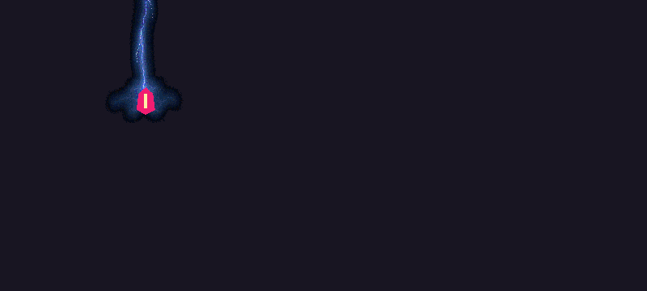
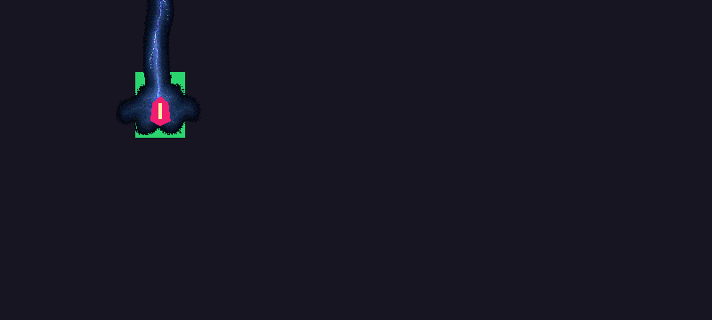
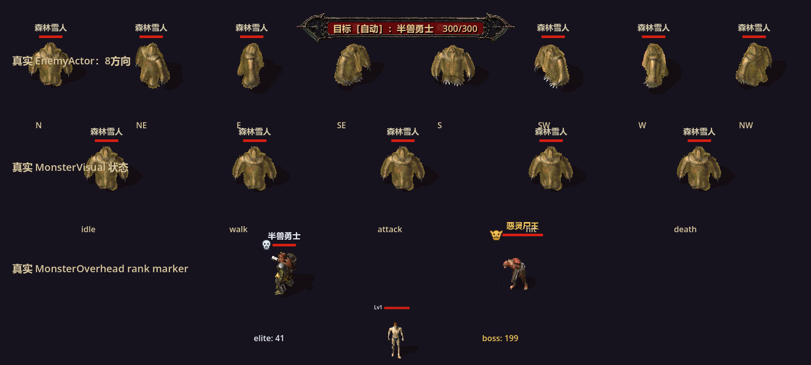

# W6 视觉渲染与来源证据

本记录对应工作树 `codex/bugfix24-visuals-20260909`，施工基线为
`692cbba5b6325ec4aaf57408e0f5f8198ff4452b`。只修改 W6 视觉 helper、HUD/拾取
展示接线、910008 专属补图、视觉测试与本目录证据；`GameRoot`、`GameData`、
`PlayerState`、`EnemyActor`、掉率/档位/属性表和地图保持冻结。

## 实现边界

- 雷电使用真实世界足点作为父 Node2D 的 Y-sort origin。Godot 4.7 的 Node2D
  没有 `y_sort_origin` 属性，因此采用父节点 `target_y - 0.01 px` 的排序代理，
  drawable 子节点补回 `+0.01 px`，可见足点仍精确落在目标足点；父子节点同为
  world z0，六帧播放 gate、伤害时刻、魔法盾和被动触发路径未改。
- `MonsterDisplayFormatter` 仅在 exact `monster_id` 的 canonical name 与
  `variant_code` 同时匹配时去除玩家展示后缀。未知 ID、ID 与名字不匹配、名字
  自带数字均保留原文。`EnemyActor` 现有的 `monster_id`、`display_name` 和
  `monster_data.classification` 是 overhead 的最小兼容输入；无需改 EnemyActor。
- overhead 保留 `setup(display_name, boss, hp, hp_max)` 四参数入口，在节点进入
  actor tree 后按 exact ID/context 解析 rank。普通怪无标记；elite 使用灰白骷髅，
  Boss 使用金色有角骷髅，Boss 优先于 elite。
- HUD `update_target` 增加可选第六参数 `monster_id := -1`，旧五参数调用仍兼容。
  integration 的正式调用应为：
  `hud.update_target(active_target.display_name, active_target.current_hp, active_target.max_hp, lock_bit, auto_target_enabled, active_target.monster_id)`。
  只在这个玩家展示边界执行变体去后缀。
- `LootVisualEffect` 按 exact item ID 读取冻结档位 authority，且要求
  presentation `kind == equipment` 与以下六个 authority `item_type` 之一：
  `戒指`、`盔甲`、`手镯`、`头盔`、`武器`、`项链`。当前允许金色光柱的 exact
  tier 为 `WOOMA_GEAR`、`ZUMA_GEAR`、`REDMOON_SET`、`HIGH_CLASS_WEAPON`、
  `EXPANDED_HIGH_WEAPON`、`LEGENDARY_WEAPON`、`NEW_CLOTHES`、
  `MAGICBLOOD_RAINBOW`、`SPECIAL_RING`。`PRAYER_MEMORY`、
  `MYSTERY_SIGNATURE`、`FUNCTIONAL_SPECIAL` 保持非线性档位策略，不纳入本轮光柱。
- 小极品颜色只读取 W7 `item_instance.drop_affix`/`modifiers` 的正式 nested
  identity，并调用 `PlayerState.create_drop_item_instance` 生成的真实正反例验证；
  顶层伪造 `drop_affix`/`modifiers`、名字或价格不能绕过检查。光柱节点属于
  `LootPickup`，失败保留、确认入账后移除，未增加全局扫描、粒子或灯光预算。
- HP 强化水使用 exact `itemId=910008` 的背包/地面两张透明 SVG。主客户端
  `Items.wil`/`Items.WIX` 与 `DnItems.wil`/`DnItems.WIX` 均检索不到该 ID 的精确
  绑定，因此 authority 明确标记 `primary_exact_source_missing_after_search`、
  `exact=false` 和 `project.hardcore.w6_hp910008_supplement`，没有借用邻近药水。

## 主源检索与素材哈希

| 对象 | SHA-256 | 结论 |
| --- | --- | --- |
| `dev_art_sources/reference/mir2_client_raw/Data/Items.wil` | `E7AA6E3B0F599118C4728BCF337084F8D0AD209F1959EA9DB71CFA63B24338BD` | 910008 精确绑定缺失 |
| `dev_art_sources/reference/mir2_client_raw/Data/Items.WIX` | `8320392C3FAF624FF57FBBBB10CCA13F9AFD49C350E6B4278FAD5A61454F8C73` | 910008 精确索引缺失 |
| `dev_art_sources/reference/mir2_client_raw/Data/DnItems.wil` | `CC9F63C26093A099C244020F373D0A573906A7D41C70CBFAB1C6E19A79D9F56B` | 地面精确绑定缺失 |
| `dev_art_sources/reference/mir2_client_raw/Data/DnItems.WIX` | `FD2A1C4F7EAE7D89130EB84E8615622448665B5AFA08DFBBF8B7CA038EAD58B5` | 地面精确索引缺失 |
| `assets/art/items/service/hp910008/hp_enhanced_inventory.svg` | `A95326EE87D917E12AE9AFBDFFF31F4DA0C635E267F2787AA56D8ABECECA2810` | W6 项目补图，背包/状态复用 |
| `assets/art/items/service/hp910008/hp_enhanced_ground.svg` | `C3E6F944A4936CE649897F907331316A1F17BA5F0AD694E9096E785647784434` | W6 项目补图，地面专用 |
| `assets/ui/monster_markers/elite_skull.svg` | `C608C47AABA6F7481593A74F393AD9BE056DE247D38A0DDD4988564666EB606C` | 灰白 elite 标记 |
| `assets/ui/monster_markers/boss_horned_gold_skull.svg` | `026C701895E60F6C89E8E0835A86F813C11D54A9843D2D359617F3E71E6339A9` | 金色有角 Boss 标记 |

## 真实渲染 probe

排序 probe 的可复现脚本和场景已归档为：

- [`W6_sort_render_probe.gd`](W6_sort_render_probe.gd)
- [`W6_sort_render_probe.tscn`](W6_sort_render_probe.tscn)

在本工作树根目录执行以下命令，使用 Godot 4.7 console 的 OpenGL
compatibility 渲染；命令不启动编辑器：

```powershell
$godot=(Resolve-Path tools/godot-4.7/Godot_v4.7-stable_win64_console.exe).Path
$env:APPDATA=(Resolve-Path .godot/runtime_appdata).Path
& $godot --path . --scene res://docs/bugfix24/20260909/W6_sort_render_probe.tscn --rendering-method gl_compatibility --rendering-driver opengl3 --resolution 800x600 --position 80,80 --log-file outputs/test_logs/w6_sort_render_probe_archived.godot.log
```

输出日志包含三次真实 capture：`same_footpoint`、`rear_wall_y210_effect_on_top`、
`front_wall_y290_wall_on_top`，并报告 `z=0 sort_key_y=249.99 visual_y=250.0
body_visible_contract=true`。三张归档图分别证明：同足点身体可见；Y=210 后墙在
effect 后方；Y=290 前墙遮住 effect 下部。图像为受控场景，未把这一组像素证据
外推到所有地图或设备：

- 
- 
- 

EnemyActor/MonsterOverhead/HUD 的真实 probe 也已归档：

- [`W6_actor_hud_render_probe.gd`](W6_actor_hud_render_probe.gd)
- [`W6_actor_hud_render_probe.tscn`](W6_actor_hud_render_probe.tscn)

执行命令：

```powershell
$godot=(Resolve-Path tools/godot-4.7/Godot_v4.7-stable_win64_console.exe).Path
$env:APPDATA=(Resolve-Path .godot/runtime_appdata).Path
& $godot --path . --scene res://docs/bugfix24/20260909/W6_actor_hud_render_probe.tscn --rendering-method gl_compatibility --rendering-driver opengl3 --resolution 1598x720 --position 80,80 --log-file outputs/test_logs/w6_actor_hud_render_archived.godot.log
```

实际渲染使用 `AMD Radeon RX 6750 GRE 12GB`。截图含 8 个真实 ordinary
`EnemyActor` 朝向、idle/walk/attack/hit/death 状态行、真实 elite `monster_id=41`
灰白标记、真实 Boss `monster_id=199` 金色有角标记，以及实际 `GameHUD` target
bar。日志输出：`target_id=41 target_text=目标［自动］：半兽勇士　300/300`，证明
HUD 收到 exact ID 后仅展示去掉确认变体的名称。归档截图：

- 

这些是受控 OpenGL console 的视觉证据；不是 headless 的替代说明，也不是
Android/真实设备验收或性能收益声明。

## 导入、专项与失败现场

自定义分支首先按项目规则运行 bootstrap，旧白名单返回：
`Unknown branch for bootstrap routing: codex/bugfix24-visuals-20260909`。
未改 bootstrap；使用指定基线、分支、tracked/untracked 检查完成等价预检，并以
受控本树导入收尾：

```powershell
$appData=(Resolve-Path .godot/runtime_appdata).Path
$env:APPDATA=$appData
$godot=(Resolve-Path tools/godot-4.7/Godot_v4.7-stable_win64_console.exe).Path
& $godot --headless --editor --path . --import --log-file outputs/test_logs/w6_controlled_import.godot.log --quit
```

导入退出码为 0；首次导入前 runner 的资源缓存缺口原始记录为
`outputs/test_logs/runner_results_adhoc_20260909_134056_737_11964.json`，修复方式
是上述受控导入，未削弱断言或改共享 allowlist。Godot 生成的
`monster_delivery_inventory.*.translation` 仅为导入副产物，不属于本包。

正式 runner（普通 30 秒）在当前 W6 候选工作树完成下列通过项；JSON 是原始结果：

| 测试 | 结果文件 |
| --- | --- |
| `tests/w6_visual_contract_test.tscn` | `outputs/test_logs/runner_results_adhoc_20260909_140423_848_12540.json` |
| `tests/sky_strike_visual_contract_test.tscn` | `outputs/test_logs/runner_results_adhoc_20260909_140601_691_24492.json` |
| `tests/lightning_runtime_map_visual_test.tscn` | `outputs/test_logs/runner_results_adhoc_20260909_140705_737_6164.json` |
| `tests/monster_species_overhead_anchor_contract_test.tscn` | `outputs/test_logs/runner_results_adhoc_20260909_140716_795_21264.json` |
| `tests/loot_pickup_ground_unit_test.tscn` | `outputs/test_logs/runner_results_adhoc_20260909_140739_208_4716.json` |
| `tests/loot_world_placement_integration_test.tscn`（60 秒） | `outputs/test_logs/runner_results_adhoc_20260909_140914_923_15680.json` |
| `tests/lootclock/loot_retry_clock_test.tscn` | `outputs/test_logs/runner_results_adhoc_20260909_141222_137_23492.json` |
| `tests/lootclock/loot_visual_clock_test.tscn` | `outputs/test_logs/runner_results_adhoc_20260909_141233_876_23820.json` |
| `tests/loot_runtime_item_policy_test.tscn` | `outputs/test_logs/runner_results_adhoc_20260909_141258_117_5320.json` |
| `tests/loot_stable_identity_save_test.tscn` | `outputs/test_logs/runner_results_adhoc_20260909_141316_559_18384.json` |
| `tests/loot_pickup_runtime_manager_test.tscn`（fixture 修正后，60 秒） | `outputs/test_logs/runner_results_adhoc_20260909_142723_680_4304.json` |

以上每项均为 `passed=1 failed=0 engine_log_errors=0`。在 fixture 修正前，
`tests/loot_pickup_runtime_manager_test.tscn` 保留了原始失败现场：
`outputs/test_logs/runner_results_adhoc_20260909_140759_934_24264.json`，原始
stderr 为 `outputs/test_logs/loot_pickup_runtime_manager_test.stderr.log`，准确断言
位置为 `tests/loot_pickup_runtime_manager_test.gd:359` 的
`_spawn_loot("强效太阳水", Vector2(12000,12000))`。该进程带有早先的 PASS marker，
随后因该断言失败而被 runner 强制终止；W6 没有修改 `GameRoot` 或该管理器，不能
把旧 fixture 现场记为通过，也没有为此弱化断言。随后仅修正该测试 fixture：等待
`_world_bootstrap_in_progress`、`_map_transition_in_progress`、有效 `player` 和
`current_map_id` 在 60 秒 deadline 内完成，再用
`game._resolve_loot_ground_position(player.global_position, player.global_position)`
取得有限落点，并以 `game._loot_ground_point_clear(loot_position)` 作真实地面断言；
FIFO、重试、失败回滚、地图代次和注销断言全部保留。修正后正式 runner 结果为
`outputs/test_logs/runner_results_adhoc_20260909_142723_680_4304.json`，
`passed=1 failed=0 engine_log_errors=0`。

最终提交后必须在最终 SHA 再复跑 W6 contract 与本表受影响的视觉专项；提交时
工作树状态、最终 SHA 和复跑 JSON 由交接消息固定记录。所有渲染和测试均在
本树独立 `.godot/runtime_appdata`/`outputs`，不生成 Android 包。

## 主树集成验收

主树合入39110308/f5136b27/2848968b，并在GameRoot目标HUD传入真实monster_id。受控headless导入exit0；runner_results_adhoc_20260909_144038_883_11920.json四项PASS（W6、lightning_runtime_map_visual、loot manager、smoke），均自然退出，无非allowlisted引擎错误。测试运行于2848968b加HUD/runner/docs未提交变更，不冒充干净HEAD或设备证据；原始日志在evidence/W6/main_integration。

